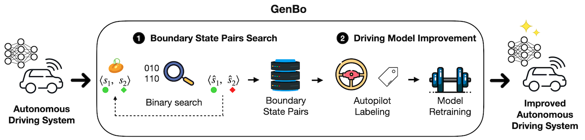
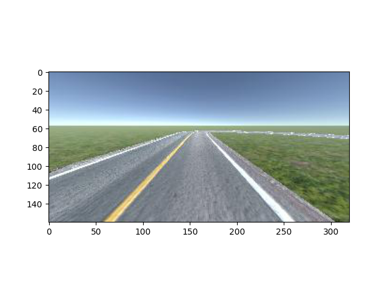

# Replication package for the paper "**Boundary State Generation for Testing and Improvement of Autonomous Driving Systems**"

Artifacts accompanying the paper *"Boundary State Generation for Testing and Improvement of Autonomous Driving Systems"* submitted for publication at Transaction on Software Engineering.

## Overview

Our tool GenBo mutates the initial driving conditions of the ego vehicle to find boundary state pairs in a failure-free environment scenario. In the next step, GenBo uses such boundary state pairs to improve the driving model. The figure below shows the two steps of the approach.



## Data

The raw data, the models, and the driving simulators are stored [here](https://drive.switch.ch/index.php/s/TkftJgfbYD2T6IO).

## 1. Installation

### 1.1 Manual

1) Install [anaconda](https://docs.anaconda.com/anaconda/install/) for your system;

2) Create the environment: `conda create -n genbo python=3.8`

3) Activate the environment: `conda activate genbo`

4) Install the requirements: `pip install -r requirements.txt`

If the `gym` library gives the following error

```commandline
error in gym setup command: 'extras_require' must be a dictionary...
```

then type

```commandline
pip install setuptools==65.5.0 "wheel<0.40.0"
```

and repeat step 4.

Download the simulator from [here](https://drive.switch.ch/index.php/s/TkftJgfbYD2T6IO).

### 1.2 Test the installation

Once the libraries are installed, and the simulator downloaded type:

```commandline

# Linux desktop
python donkey_test.py --donkey-exe-path ~/donkey-genbo-linux/donkey_sim.x86_64 \
    --donkey-scene-name generated_track --track-num 0

# Mac desktop
python donkey_test.py --donkey-exe-path ~/donkey-genbo-mac/donkey_sim.app \
    --donkey-scene-name generated_track --track-num 0

```

The program should print an image like the following on `logs/donkey_test.png`:



## 2. Execute the experiments

Assuming that the commands below will be executed on Mac. 

### 2.1 Search for boundary state pairs

The following command search for boundary state pairs (called frontier pairs in the code) of the weakest model `donkey-dave2-m1.h5`.

```commandline

cd scripts
conda activate genbo

bash -i search.sh --model donkey-dave2-m1.h5 \
    --donkey-exe-path ~/donkey-genbo-mac/donkey_sim.app \
    --num-iterations 10 --num-restarts 2 --seed 0

```

It should find, on average, one boundary state pair in about 15 minutes.

The following command search for boundary state pairs of the second weakest model `donkey-dave2-m2.h5`.

```commandline

cd scripts
conda activate genbo

bash -i search.sh --model donkey-dave2-m2.h5 \
    --donkey-exe-path ~/donkey-genbo-mac/donkey_sim.app \
    --num-iterations 10 --num-restarts 10 --seed 0

```

It should find, on average, one boundary state pair in about 60 minutes (note that the number of restarts increased from `2` to `10` since the model is stronger).

The data for the first step of the search are [here](https://drive.switch.ch/index.php/s/FNMZbiqXDXJIsuM).

### 2.2 Recovery

To run the recovery procedure type:

```commandline

cd scripts
conda activate genbo

bash -i replay.sh --model-to-test donkey-dave2-m2.h5 \
    --model-tested donkey-dave2-m1.h5 --execute-failure-member false \ 
    --donkey-exe-path ~/donkey-genbo-mac/donkey_sim.app

bash -i replay.sh --model-to-test donkey-dave2-m2.h5 \
    --model-tested donkey-dave2-m1.h5 --execute-failure-member true \ 
    --donkey-exe-path ~/donkey-genbo-mac/donkey_sim.app

```

to execute the `m2` model on the boundary state pairs of the `m1` model (first on the non-failure members of the pairs, then on the failure members); the recovery percentages should be respectively 100% and 80/100%. Add the `--video` option to save videos of the recovery (each individual of the pair is executed five times).

Likewise run the following commands:

```commandline

cd scripts
conda activate genbo

bash -i replay.sh --model-to-test donkey-dave2-m1.h5 \
    --model-tested donkey-dave2-m2.h5 --execute-failure-member false \ 
    --donkey-exe-path ~/donkey-genbo-mac/donkey_sim.app

bash -i replay.sh --model-to-test donkey-dave2-m1.h5 \
    --model-tested donkey-dave2-m2.h5 --execute-failure-member true \ 
    --donkey-exe-path ~/donkey-genbo-mac/donkey_sim.app

```

to execute the `m1` model on the boundary state pairs of the `m2` model (first on the non-failure members of the pairs, then on the failure members); the recovery percentages should be respectively 40% and 0%.

### 2.3 Retraining

Now suppose that we want to improve the second model `m2`. 

#### 2.3.1 Labeling

First we need to run the autopilot on the boundary state pairs of `m2` and use it to label the images on those boundary conditions. Since the `m2` struggles on the failure members of the pairs, we execute the autopilot only there.

```commandline

cd scripts
conda activate genbo

bash -i replay.sh --model-to-test autopilot \
    --model-tested donkey-dave2-m2.h5 --execute-failure-member true \ 
    --collect-images true --donkey-exe-path ~/donkey-genbo-mac/donkey_sim.app

```

#### 2.3.2 Retraining

The second step is to retrain the model on the newly created dataset (assuming it is named `donkey-2024_06_20_16_50_58-finetuning-agent-dave2-m2-generated_track-0*.npz`, placed under `logs`) merged with the original dataset (that you can donwload from [here](https://drive.switch.ch/index.php/s/TkftJgfbYD2T6IO), it is under `dataset`; the original dataset should be placed under `logs`). Type:

```commandline

cd scripts
conda activate genbo

bash -i ./retrain_models.sh --finetuning-archive donkey-2024_06_20_16_50_58-finetuning-agent-dave2-m2-generated_track-0 \
    --original-archive donkey-archive-agent-autopilot-episodes-6-generated_track-0 \
    --model-name-suffix donkey-dave2-m2

```

to retrain the `m2` model. On CPU it takes a long time; if you have an NVIDIA GPU and [docker](https://docs.docker.com/engine/install/ubuntu/) with the [NVIDIA container toolkit](https://docs.nvidia.com/datacenter/cloud-native/container-toolkit/latest/install-guide.html) installed you can use the `Dockerfile` in this repository to build the container and run the previous command within it:

```commandline

docker build -t genbo:dev .
docker run --rm --gpus all -u ${UID} -it --mount type=bind,source="$(pwd)",target=/home/genbo --workdir /home/genbo --name bostage-container genbo:dev

cd scripts
./retrain_models.sh --finetuning-archive donkey-2024_06_20_16_50_58-finetuning-agent-dave2-m2-generated_track-0 \
    --original-archive donkey-archive-agent-autopilot-episodes-6-generated_track-0 \
    --model-name-suffix donkey-dave2-m2

exit

```

#### 2.3.3 Evaluating

The last step is to evaluate the original and retrained models on eight evaluation tracks (plus the original training track, i.e., track `0`). We first evaluate the original `m2` model on all the tracks as follow:

```commandline

cd scripts
conda activate genbo

bash -i ./evaluate.sh --model donkey-dave2-m2.h5 --num-episodes 5 --max-steps 200 \
    --donkey-exe-path ~/donkey-genbo-mac/donkey_sim.app

```

The script runs the model on nine tracks, including the original, for five episodes of maximum 200 steps (i.e., the model succeeds in an episode if it runs for 200 steps). The default is `num_episodes=100` and `max_steps=1000`. This needs to be executed only once when there are multiple retrainings. We then run the retrained model on all the tracks as follow:

```commandline

cd scripts
conda activate genbo

bash -i ./evaluate.sh --model donkey-dave2-m2-run-1 --num-episodes 5 \
    --max-steps 200 --num-run 1 --donkey-exe-path ~/donkey-genbo-mac/donkey_sim.app

```

Since we have only one run, i.e., one search run producing the boundary state pairs, we use `num_run=1`. The command needs to be repeated for each retraining run.

#### 2.3.3 Process evaluation

The last step consists of processing the evaluation logs as follow:

```commandline

cd scripts

# process logs of original model
./process_evaluation_logs.sh --original true --model donkey-dave2-m2
# process logs of retrained models
./process_evaluation_logs.sh --model donkey-dave2-m2

```

The second command looks for all retrained models stemming from `donkey-dave2-m2`, i.e., `donkey-dave2-m2-run-{i}`. In this case there is only one retrained model of `donkey-dave2-m2`, i.e., `donkey-dave2-m2-run-1`. The two commands print the success rates on the original and the seven evaluation tracks, sorted in this way. It should print the following:

```commandline
------------ donkey-dave2-m2 -----------
DEBUG:collect_images:Success rate: 1.00
DEBUG:collect_images:Success rate: 0.00
DEBUG:collect_images:Success rate: 0.00
DEBUG:collect_images:Success rate: 0.00
DEBUG:collect_images:Success rate: 0.00
DEBUG:collect_images:Success rate: 0.00
DEBUG:collect_images:Success rate: 0.00
DEBUG:collect_images:Success rate: 0.00
DEBUG:collect_images:Success rate: 0.00

------------ donkey-dave2-m2-run-1 -----------
DEBUG:collect_images:Success rate: 1.00
DEBUG:collect_images:Success rate: 0.40
DEBUG:collect_images:Success rate: 0.80
DEBUG:collect_images:Success rate: 0.40
DEBUG:collect_images:Success rate: 0.40
DEBUG:collect_images:Success rate: 0.20
DEBUG:collect_images:Success rate: 0.40
DEBUG:collect_images:Success rate: 0.20
DEBUG:collect_images:Success rate: 0.00
```

